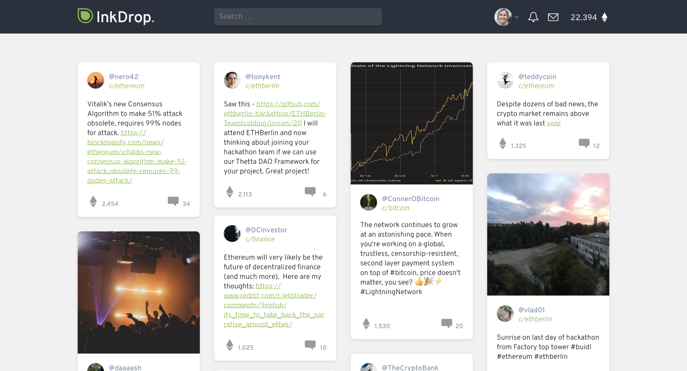
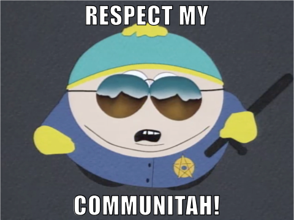

# InkDrop – Eth Free Speech Bulletin Board

Learn more @ [Medium](https://medium.com/inkdrop), [Twitter](https://twitter.com/JoinInkDrop) and [Reddit](https://www.reddit.com/r/InkDrop).

[InkDrop.tech](https://inkdrop.tech) brings free speech and civil discourse to everyone. InkDrop is the blockchain community’s answer to today’s centralized social media landscape.

As part of the Web3 movement, our goal is to develop a fully decentralized platform based on the Ethereum blockchain & IPFS.

## What's the point though?

"_Decentralization reduces large structural asymmetries._" – Nassim Nicholas Taleb

The Internet is plagued by a dilemma. Social networks are either:

- Censorship-free and unmoderated **but** people start posting ugly/harmful stuff that nobody wants to see (or very few).
- Centrally operated and mainstream **but** it's being censored by entities that are somewhat ignorant or biased (or both). See Google, Facebook, Twitter, Patreon et al.

In the name of free speech & self-determination on the Internet, we propose a new way forward. A kind of network that cleverly combines ignorant/biased censorship with ugly/harmful posts. Just kidding...it's the other thing.

Decentralized systems allow us to disintermediate social media and empower the single user. The overall goal is to create a self-regulating social network of the users, by the users, for the users.

## Cool, but hoe does it work?

First of all, InkDrop is built on Ethereum & IPFS and, thus, operates fully decentralized. [InkDrop.tech](https://inkdrop.tech) (+ [MetaMask](https://metamask.io) installed) is bascially just your Web3 gateway.

Second, the network is governed by the community. This is made possible through math, game theory and...money. Thanks to the integration of Ether cryptocurrency we can design a protocol that incentivizes sensible content moderation. We call that protocol [Proof-of-Care](#proof-of-care-concept) (PoC).

Third, we don't use algorithms to show you what you already know you like. Subjective ranking algorithms are known to create echo chambers, which are "ripping apart the social fabric of how society works” (Chamath Palihapitiya). InkDrop content ranking is completely based on upvotes, which are directly linked to Ether cryptocurrency. After a while, these upvotes are used up and 90% of the Ether got to the creator of the post. To keep the creator from endlessly upvoting his own content, InkDrop keeps the other 10% of the _upvote Ether_. These 10% are used to for the PoC protocol incentives.

All in all, it's an open source platform where the community is in charge. In our vision InkDrop evolves to a self-improving ecosystem where diverse public interactions are fostered and a humane/civil discourse is maintained.

## How far along are you?

## Proof-of-Care concept

Integrity. No one single entity moderates the site.
governance protocol
incentivizes content moderation based on the lowest common denominator
so, not for whiny bitches
it's to fight objectively bad content

## Roadmap

-

## FAQs

### Are there any other benefits to decentralization?

Sure there are. blockchain - censorship-resistant - free speech even in Iran...

## Smart Contracts

The project is based arround a set of smart contracts (you find them in the `contracts` folder) and a React frontend (check the `src` folder) with an optimistic UI apporach (we do not want to bother the user with transaction or throughput issues).

All of the platform's logic is embedded in the smart contract `InkDrop.sol`. We use `ZeppelinOS` for the implementation of a fully upgradeably smart contract using a proxy system: for each deployed contract implementation (the logic contract), another, user-facing contract is deployed as well (the proxy). The proxy will be the one in charge of the contract's storage, but will forward all function calls to the backing logic contract. Please see the `DEPLOY_GUIDE.md` for further instructions how to deploy our upgradeable smart contract. Feel free to deploy the smart contracts to your local testnet.

All unit tests for the smart contract can be found in the `test` folder. We write our test cases in Javascript based on [Mocha](https://mochajs.org/) testing framework and [Chai](http://chaijs.com/) for assertions. Tests can be run with `truffle test` or `truffle test ./test/InkDrop.user.test.js` in order to limit the tests being executed to a specific file. See the [truffle doc](https://truffleframework.com/docs/truffle/testing/writing-tests-in-javascript) for further explanations.

Currently our smart contracts are deployed to Rinkeby at [0xc467653303a190248ba4642e8988a5e24b03160f](https://rinkeby.etherscan.io/address/0xc467653303a190248ba4642e8988a5e24b03160f).

## React Frontend

InkDrop's frontend is implemented in React with heavy usage of [Redux](https://redux.js.org/), [Redux-Saga](https://redux-saga.js.org/), [Drizzle](https://truffleframework.com/docs/drizzle/overview) and [ipfs-api](https://github.com/ipfs/js-ipfs-api). The project is set up via [create-react-app](https://github.com/facebook/create-react-app) and uses a feature centric file structure (see explanation [here](https://reactjs.org/docs/faq-structure.html#grouping-by-features-or-routes)).

## Setup Guide

1.  Get the [Ganache app](http://truffleframework.com/ganache/) and start it
2.  Clone this repository
3.  Run `npm install`
4.  Compile and deploy the smart contracts to the testnet (see `DEPLOY_GUIDE.md`)
5.  Run `npm run start`

## Environment Variables

Set up a `.env` file with the following environment variables:

- REACT_APP_MNEMONIC=''
- REACT_APP_INFURA_API_KEY=''
- REACT_APP_GA_ID=''
- REACT_APP_IPFS_GATEWAY='https://cloudflare-ipfs.com/ipfs/'
- REACT_APP_MIN_DROP=0.001
